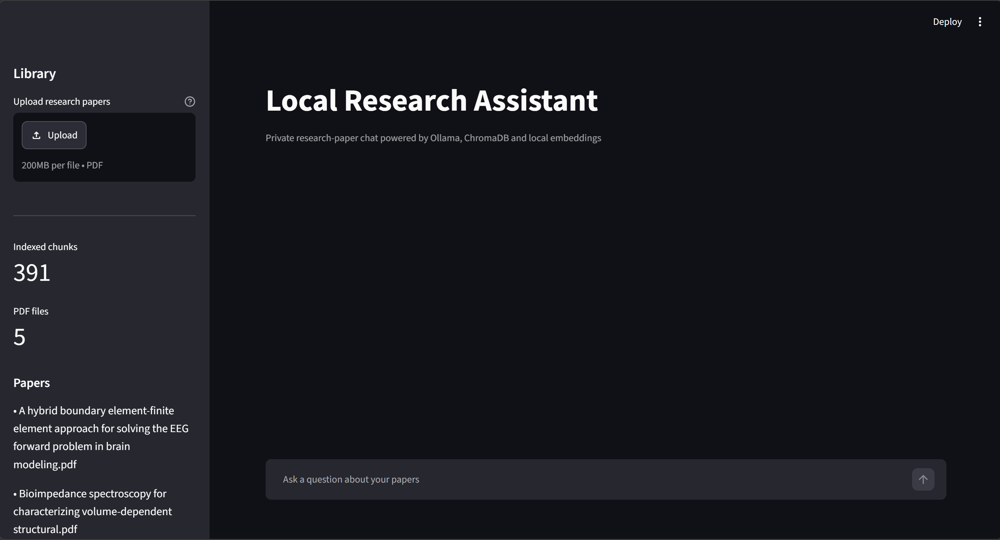
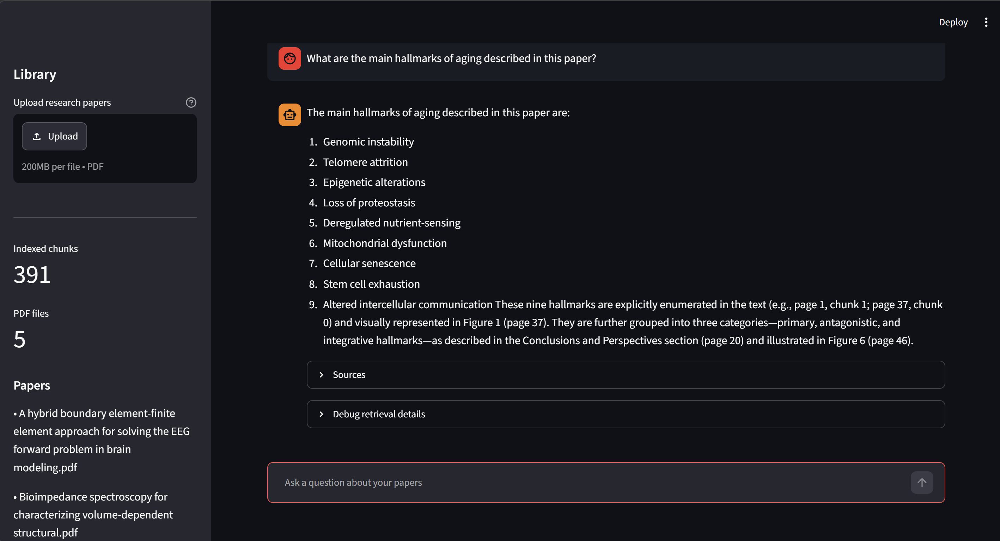
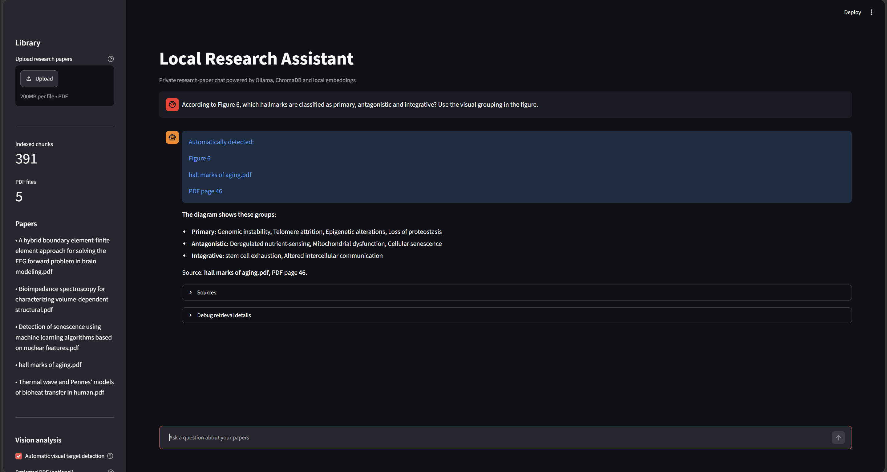
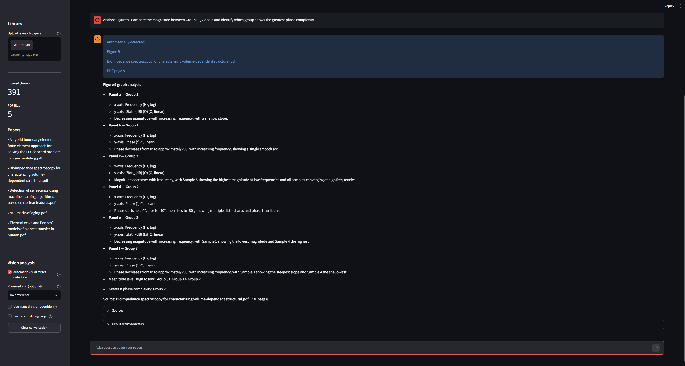

# Local Multimodal Research Assistant

A fully local AI research assistant for querying scientific papers, retrieving evidence, and analysing complex figures, diagrams, graphs, tables, and equations.

The project combines retrieval-augmented generation with multimodal scientific document analysis using Ollama, ChromaDB, Sentence Transformers, PyMuPDF, reranking, and a local Qwen vision model. It is designed to keep document processing and inference local while producing evidence grounded answers from research PDFs.

## Overview

Scientific papers are difficult for standard RAG systems because important information is often contained in figures, diagrams, graphs, and tables rather than plain text.

This project extends a conventional text RAG pipeline with a dedicated multimodal evidence pipeline that can:

- Locate a referenced figure or table automatically
- Render the appropriate PDF page or region
- Analyse scientific visuals with a local vision language model
- Extract structured evidence
- Validate the extraction before using it
- Retry targeted regions when information is incomplete
- Combine visual and textual evidence into a grounded answer
- Explicitly report uncertainty rather than silently inventing missing information

The entire workflow runs locally.

## Key Features

### Retrieval Augmented Generation

- Local semantic search over scientific PDFs
- Sentence Transformer embeddings
- Persistent ChromaDB vector storage
- Retrieval reranking before answer generation
- Evidence aware final answer composition
- Follow up questions using retrieved document context

### Scientific Figure Analysis

- Automatic detection of references such as `Figure 6`, `Fig. 13b`, and `Table 1`
- Automatic PDF and page resolution
- Figure, table, graph, equation, and diagram classification
- Full-page and targeted region rendering
- Local vision language model analysis
- Structured JSON extraction
- Validation before visual evidence is accepted

### Complex Visual Reasoning

The system includes specialised handling for dense scientific visuals.

Examples include:

- Multi section labelled diagrams
- Multi panel Bode plots
- Nyquist plots
- Circuit diagrams
- Scientific tables
- Equations
- Figures containing overlapping or spatially grouped labels

For grouped diagrams, the pipeline can generate overlapping regional crops and preserve spatial relationships between labels and group headings.

For scientific graphs, panel identities are preserved across targeted rereads so visual evidence remains associated with the correct group or subplot.

### Completeness Validation

When the associated caption states an expected number of visual elements, the system can use that information to validate extraction completeness.

For example, if a caption states that a diagram contains nine items but only eight are recovered, the result is not silently accepted as complete.

Instead, the system can:

1. Detect the count mismatch
2. Preserve already validated detections
3. Identify the region most likely to contain the missing content
4. Generate a higher resolution targeted crop
5. Use a neutral visual transcription prompt
6. Merge only visually verified evidence
7. Return an explicit incomplete result if recovery still fails

This prevents incomplete extractions from being presented as complete answers.

### Scientific Graph Comparison

Multi panel scientific graph analysis includes:

- Canonical panel and group identifiers
- Source bound panel rereads
- Shared x coordinate comparisons
- Relative or numeric curve readings
- Confidence and readability validation
- Tie and contradiction handling
- Agreement based magnitude ordering

Strict rankings are only produced when supported by comparable visual evidence.

### Local and Private

Document processing and inference are performed locally using Ollama.

Research papers do not need to be uploaded to an external model provider.

## Architecture

```text
Scientific PDFs
      |
      v
   PyMuPDF
      |
      +------------------------------+
      |                              |
      v                              v
Text extraction                Visual indexing
      |                              |
      v                              v
Sentence Transformers        Figure / table resolver
      |                              |
      v                              v
   ChromaDB                  Page / region rendering
      |                              |
      v                              v
Retrieval + reranking          Qwen vision model
      |                              |
      |                       Structured evidence
      |                              |
      +---------------+--------------+
                      |
                      v
               Evidence validation
                      |
             +--------+--------+
             |                 |
             v                 v
       Text evidence      Visual evidence
             |                 |
             +--------+--------+
                      |
                      v
               Local Qwen LLM
                      |
                      v
             Grounded final answer
                      |
                      v
             Streamlit interface
```

## Example Capabilities

### Grouped Scientific Diagrams

The system can analyse figures where labels belong to spatially defined categories.

A validated Hallmarks of Aging test identifies all nine hallmarks and assigns them to:

- Primary
- Antagonistic
- Integrative

The pipeline detects an incomplete 8 of 9 extraction and performs a targeted visual recovery rather than presenting an incomplete answer.

### Multi-Panel Scientific Graphs

The system can analyse six-panel Bode diagrams containing three experimental groups.

It preserves panel identity during targeted rereads and compares magnitude curves at shared frequencies before producing a strict ordering.

The validated Figure 9 regression identifies:

```text
Magnitude:
Group 3 > Group 1 > Group 2

Greatest phase complexity:
Group 2
```

The comparison is based on visual evidence rather than hard-coded scientific values.

## Screenshots

### Main Interface



### Text RAG

The assistant retrieves relevant evidence from indexed research papers and generates a grounded response.



### Multimodal Figure Analysis

The system automatically resolves Figure 6, analyses its visual grouping, validates the expected number of elements, and recovers all nine hallmarks.



### Scientific Graph Analysis

The multimodal graph pipeline preserves panel identities and compares magnitude curves using shared-frequency visual evidence.



## Technology Stack

| Component | Technology |
|---|---|
| Interface | Streamlit |
| Local LLM runtime | Ollama |
| Text generation | Qwen |
| Vision analysis | Qwen Vision |
| Vector database | ChromaDB |
| Embeddings | Sentence Transformers |
| PDF processing | PyMuPDF |
| Retrieval | Semantic vector search |
| Ranking | Reranking pipeline |
| Testing | pytest |
| Language | Python |

## Local Models

The project uses Ollama for local model inference.

Example model setup:

```powershell
ollama pull qwen3.5:9b
ollama pull qwen3-vl:8b-instruct
```

A custom vision configuration can also be created from the included `Modelfile.vision`:

```powershell
ollama create research-vision:latest -f Modelfile.vision
```

Verify the model configuration with:

```powershell
ollama show research-vision:latest --modelfile
```

Model names can be adjusted in the project configuration if different compatible local models are preferred.

## Installation

### 1. Create a Python environment

On Windows PowerShell:

```powershell
python -m venv .venv
.\.venv\Scripts\Activate.ps1
```

### 2. Install dependencies

```powershell
pip install -r requirements.txt
```

### 3. Install and start Ollama

Install Ollama and ensure the required local models are available.

Check installed models:

```powershell
ollama list
```

If the Ollama service is not running:

```powershell
ollama serve
```

### 4. Add research papers

Place local research PDFs in the application's configured papers directory.

PDF files and local research documents are excluded from version control.

### 5. Start the application

```powershell
streamlit run app.py
```

Then open the local Streamlit address displayed in the terminal.

## Example Questions

Text-based questions:

```text
Summarise the main findings of this paper.
```

```text
What methodology did the authors use?
```

Explicit visual references:

```text
According to Figure 6, which hallmarks are classified as primary,
antagonistic and integrative? Use the visual grouping in the figure.
```

```text
Analyse Figure 9. Compare the magnitude between Groups 1, 2 and 3
and identify which group shows the greatest phase complexity.
```

Panel follow-ups:

```text
What about panel c?
```

```text
Explain Fig. 13b.
```

## Visual Target Resolution

When a question contains a visual reference, the system attempts to resolve:

- Document
- Page
- Figure or table number
- Panel
- Caption
- Nearby supporting text
- Visual type
- Resolution confidence

This allows visual questions to be routed to the appropriate analysis pipeline rather than treated as ordinary text queries.

## Evidence Validation

Visual model output is not automatically trusted.

The pipeline validates structured evidence before it is used in an answer.

Validation includes checks such as:

- Required fields
- Duplicate detections
- Panel identity
- Group identity
- Expected item counts
- Axis metadata
- Visual readability
- Confidence
- Contradictory evidence
- Missing information
- Cross-region consistency

When evidence cannot be validated, the system prefers an explicit uncertainty or incomplete result over an unsupported answer.

## Regression Testing

The project includes automated regression tests for both deterministic components and real local-model execution.

The final verified full regression suite currently passes:

```text
361 passed
0 failed
0 skipped
```

The suite covers:

- Text RAG
- Document summaries
- Visual target resolution
- Scientific labelled diagrams
- Multi panel graphs
- Circuit diagrams
- Scientific tables
- Equations
- Completeness validation
- Targeted visual recovery
- Panel identifier normalization
- Shared frequency graph comparison
- Visual uncertainty handling
- Production `ResearchAssistant.ask()` execution paths

Important multimodal cases are also tested through the same backend used by the Streamlit application.

### Run the fast regression tests

```powershell
python scripts/run_regression_suite.py --fast
```

### Run local-model regressions

```powershell
python scripts/run_regression_suite.py --ollama
```

### Run the complete regression suite

```powershell
python scripts/run_regression_suite.py --all
```

## End to End RAG Evaluation

The repository also contains an end to end scientific RAG evaluation framework.

Example:

```powershell
python scripts/run_e2e_rag_eval.py --suite tests/evals/senescence_v13.json
```

Run an individual evaluation question:

```powershell
python scripts/run_e2e_rag_eval.py --suite tests/evals/senescence_v13.json --question Q05
```

Run repeated evaluation passes:

```powershell
python scripts/run_e2e_rag_eval.py --suite tests/evals/senescence_v13.json --runs 3
```

Generated evaluation outputs and raw model responses are excluded from version control.

## Project Structure

```text
.
├── app.py
├── chat.py
├── config.py
├── ingest.py
├── settings.py
├── Modelfile.vision
├── requirements.txt
│
├── rag/
│   ├── retrieval and vector-search components
│   └── embedding / database utilities
│
├── services/
│   ├── research assistant orchestration
│   ├── visual target resolution
│   ├── vision analysis
│   ├── structured visual validation
│   ├── answer composition
│   └── local Ollama integration
│
├── evaluation/
│   ├── evaluation runner
│   └── scoring utilities
│
├── scripts/
│   ├── regression runner
│   ├── end-to-end evaluation
│   └── vision utilities
│
├── tests/
│   ├── deterministic tests
│   ├── local-model regression tests
│   └── scientific evaluation cases
│
├── ui/
│   └── Streamlit UI components
│
└── assets/
    └── README screenshots
```

Local vector databases, generated outputs, temporary crops, model files, environment files, and research PDFs are excluded through `.gitignore`.

## Privacy

The application is designed around local inference.

When configured with local Ollama models:

- PDFs remain on the local machine
- Embeddings are generated locally
- Vector storage remains local
- Vision analysis runs locally
- Answer generation runs locally

This makes the project suitable for experimenting with documents that should not be sent to external model APIs.

## Reliability Principles

The multimodal pipeline follows several design rules:

1. Prefer grounded visual evidence over unsupported model assumptions.
2. Preserve deterministic metadata such as source page, panel, region, and group whenever possible.
3. Do not silently convert ambiguous evidence into a confident classification.
4. Use targeted retries rather than repeatedly rerunning the entire visual analysis.
5. Do not use retrieved text to invent labels that were not visually confirmed.
6. Treat incomplete visual extraction explicitly as incomplete.
7. Preserve uncertainty when evidence remains contradictory or unreadable.

## Current Limitations

The project is designed for local research use and still has practical limitations:

- Local multimodal inference can be significantly slower than hosted APIs.
- Performance depends on available RAM, VRAM, and the selected Ollama models.
- Extremely dense or low-resolution figures may require multiple visual passes.
- Scientific graph reading remains approximate and is intended for comparative interpretation rather than precision digitisation.
- Complex visual layouts may still require uncertainty handling when evidence cannot be verified.

## Future Improvements

Potential extensions include:

- Support for additional local vision language models
- Improved document level citation presentation
- Faster visual inference and crop scheduling
- Expanded scientific graph interpretation
- Larger evaluation datasets
- Cross document evidence synthesis
- Improved document ingestion workflow
- Additional automated end to end UI testing

## Development Philosophy

The project prioritises correctness and traceable evidence over producing an answer at all costs.

A failed or incomplete extraction should remain visible as uncertainty rather than being replaced with an unsupported model guess.

This is especially important when working with scientific literature, where a plausible but incorrect answer can be more misleading than an explicit failure.

## Purpose

This project was built as a practical exploration of:

- Retrieval augmented generation
- Local large language models
- Multimodal AI
- Scientific document understanding
- Evidence validation
- AI agent orchestration
- Automated evaluation
- Reliable local inference

It demonstrates how text retrieval and multimodal reasoning can be combined into a local scientific research workflow rather than relying on text-only RAG.